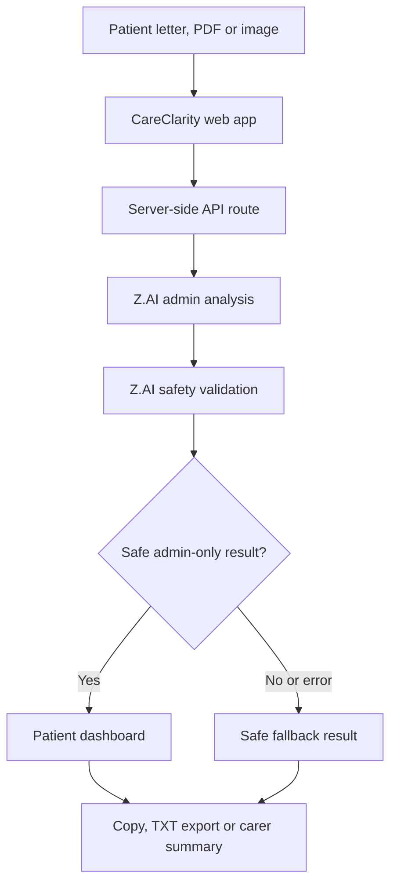
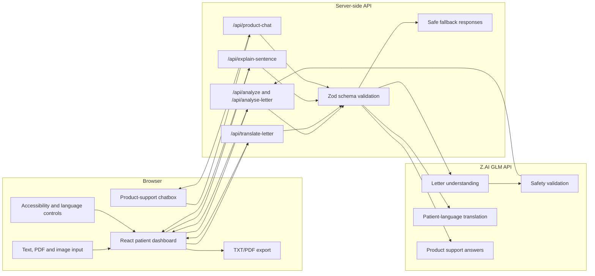
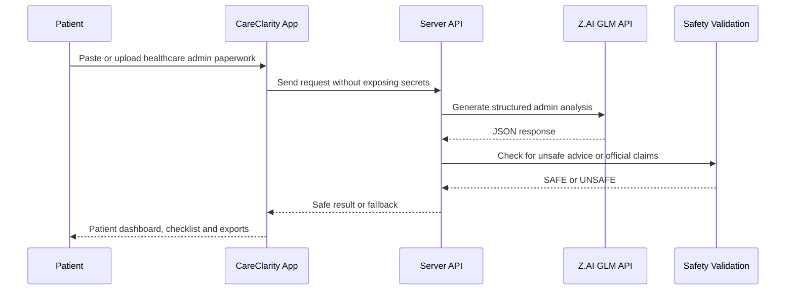
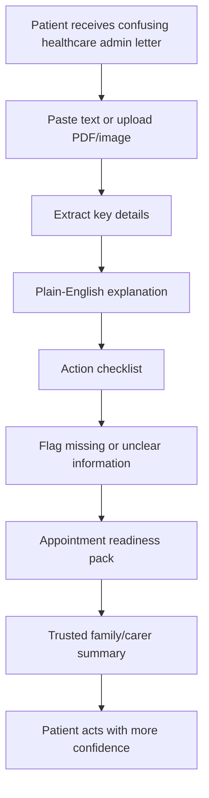

# CareClarity

CareClarity is a mobile-friendly healthcare administration companion that helps patients understand NHS-style appointment letters, referral updates, prescription paperwork and admin instructions in plain English. It is designed for people who feel confused, anxious or unsure after receiving healthcare paperwork, especially when details are missing, unclear or written in formal language.

CareClarity does not provide diagnosis, treatment advice, prescribing advice or medication-change guidance. It focuses only on administrative understanding: what the letter says, what the patient may need to do, what details should be checked, and what questions can be asked safely.


## Live Product

Full Vercel deployment with frontend and backend API routes:

[https://careclarity-eleven.vercel.app](https://careclarity-eleven.vercel.app)

Use the Vercel version for the full Z.AI-powered workflow, including letter analysis, translation, sentence explanation and product-support chat.

## Built At

CareClarity was built by team **Eleven** at **Vibehack London 2026**.

Vibehack London 2026 was a 24-hour AI hackathon at UCL for builders, hackers and future founders. CareClarity was created as a practical response to a real UK problem: patients often receive important healthcare admin letters that are difficult to understand, especially when they contain missing details, unclear instructions, unfamiliar terms or appointment actions with no obvious next step.

## Why CareClarity

Healthcare paperwork often assumes that patients understand clinic language, referral wording, appointment rules and NHS admin processes. In real life, many people need help with questions like:

- What is this letter asking me to do?
- Is this an appointment, referral, prescription admin note or waiting-list update?
- Where do I need to go?
- Is there a date, time or contact number?
- What should I ask the clinic, GP practice, pharmacy or admin team?
- What should I share with a trusted family member or carer?
- Can I understand this in my own language?

CareClarity turns confusing paperwork into a simple patient dashboard while keeping a strict safety boundary: it explains admin information only.

## How It Works

1. A patient pastes a synthetic healthcare admin letter or uploads a PDF/image.
2. CareClarity sends the request to a server-side Z.AI workflow.
3. Z.AI extracts key admin details and creates a plain-English explanation.
4. A safety validation layer checks the output for unsafe medical advice or unsupported official claims.
5. If the result is safe, CareClarity shows the patient dashboard.
6. If the result is unsafe or unavailable, CareClarity returns a safe fallback instead of guessing.



## Project Features

- **Letter understanding:** explains NHS-style healthcare admin letters in plain English.
- **PDF and image upload:** users can upload prescription or letter files in PDF/image format.
- **No login required:** patients do not need to register or create an account.
- **No database storage:** pasted text and uploaded files are used for the request only and are not saved by CareClarity.
- **Structured information extraction:** identifies letter type, clinic/department, date, time, location, contact info, clinician/team and action required.
- **Plain-English translation:** rewrites complex admin wording into clear everyday language.
- **Action checklist:** gives safe admin-only next steps, such as confirming an appointment or checking missing details.
- **Appointment Readiness Pack:** prepares key details, before-you-go steps, documents to bring and items to confirm.
- **Missing or unclear detail flags:** highlights no date, no time, no location, unclear contact number, conflicting instructions and action required with no deadline.
- **What Changed? letter comparison:** compares an older and newer letter to identify changed appointment or admin details.
- **Two-letter upload for comparison:** supports uploading one older letter and one newer letter, or pasting both texts.
- **Trusted family/carer summary:** creates a clean downloadable TXT/PDF summary with appointment details, checklist, contact info, questions and safety notice.
- **Prescription Admin Helper:** extracts collection/admin wording, reference numbers and contact details without medicine advice.
- **NHS App Navigation Helper:** gives admin-only guidance on where to look in the NHS App for appointments, messages, referrals or prescriptions.
- **Explain this sentence:** lets users paste one confusing sentence and get an admin-only explanation.
- **Multilingual translation:** translates healthcare admin letters into Bengali, Urdu, Arabic, Polish, Romanian, Punjabi, Hindi, Gujarati, Somali, Spanish, French, Chinese and Ukrainian.
- **Product language selector:** reloads the CareClarity interface in the user's preferred language, with English as the default.
- **Product-support chatbox:** lets users ask how to use CareClarity in their own language while refusing illegal, harmful or medical-advice requests.
- **Accessibility Mode:** optional large text, high contrast, easy-read spacing, dyslexia-friendly layout support and browser read-aloud.
- **Always-visible safety banner:** reminds users that CareClarity explains admin information only.
- **Safe fallback behavior:** if Z.AI is unavailable or returns invalid output, the app uses a safe local fallback.
- **Copy/download support:** users can copy or download results as `.txt`.

## System Architecture

CareClarity is a client-first web application with server-side API routes for AI calls. The frontend never receives the Z.AI API key.



### Core Stack

| Layer | Tools |
| --- | --- |
| Frontend | React, TypeScript, Vite |
| Styling and UI | CSS, Lucide React icons, responsive card layout |
| Validation | Zod schemas for AI responses and API inputs |
| AI workflow | Z.AI GLM API through server-side routes |
| Testing | Vitest |
| Build | TypeScript compiler and Vite |
| Safety | Admin-only prompts, schema validation, safety validation, fallback responses |

## Z.AI-Powered Workflow

CareClarity uses the GLM ZAI API for:

- Letter understanding
- Letter comparison support through structured analysis
- Product-support chatbox
- Key detail extraction
- Plain-English explanation
- Action checklist generation
- Appointment preparation guidance
- Clinician question generation
- Missing and unclear detail detection
- Safety validation
- Multilingual translation into patient languages
- Sentence-level explanation
- Safe fallback decision support



## Privacy And Safety

CareClarity is designed as an admin-support prototype, not a medical chatbot.

- It does not diagnose conditions.
- It does not recommend medicines.
- It does not tell users to start, stop, change, increase or decrease medication.
- It does not recommend treatment plans.
- It does not replace NHS clinicians, GP practices, pharmacists or emergency services.
- It does not claim official NHS endorsement.
- It does not require account registration.
- It does not store pasted letters, prescription text or uploaded files in a backend database.
- It keeps the `ZAI_API_KEY` server-side only.

The multilingual translation feature is for admin understanding only. It preserves dates, times, locations, phone numbers, clinic names and appointment instructions as closely as possible, but it is not medical advice.

For urgent medical help in the UK, use NHS 111. For life-threatening emergencies, call 999.

## Why CareClarity Is Better

| Need | Standard PDF reader | Browser translator | Generic search | NHS App alone | CareClarity |
| --- | --- | --- | --- | --- | --- |
| Explains confusing admin wording | No | Partly | Indirectly | Limited | Yes, in plain English |
| Extracts appointment date, time, location and contact info | No | No | No | Only if shown in the app | Yes |
| Flags missing or unclear details before the patient acts | No | No | No | No | Yes |
| Creates an action checklist | No | No | No | No | Yes |
| Helps prepare for appointments | No | No | No | Limited | Yes |
| Suggests safe questions to ask a clinician or admin team | No | No | No | No | Yes |
| Compares old and new letters | No | No | No | No | Yes |
| Creates a family/carer summary | No | No | No | No | Yes, TXT/PDF |
| Explains prescription admin without medicine advice | No | Risky | Risky | Limited | Yes, admin-only |
| Supports patient languages | No | Yes, but not healthcare-admin aware | Indirectly | Limited | Yes, with safety notices |
| Has explicit safety validation | No | No | No | N/A | Yes |
| Works without login | Yes | Yes | Yes | No | Yes |
| Avoids storing patient records in the app database | N/A | Varies | Varies | NHS-managed | Yes, no CareClarity database |

CareClarity is better because it is not trying to be a general medical assistant. It solves a narrower, real-life problem: helping patients understand and act on healthcare administration safely.

## Research And Supporting Tools

### Manus

Used Manus for:

- Researching patient admin pain points
- Summarising NHS-style admin problems
- Preparing user personas
- Creating a competitor comparison
- Drafting Devpost content
- Preparing the demo script
- Organising evidence
- Creating project workflow notes

### Fotor

Used Fotor for:

- Product poster
- Before/after patient confusion graphic
- Z.AI workflow infographic
- Multilingual accessibility graphic
- Devpost banner
- Demo slide-style image

### Cursor

Used Cursor for:

- Improving layout, spacing, card widths, buttons and text readability
- Fixing selected TypeScript errors
- Polishing the user interface during the hackathon build

## Product Workflow Notes



## Supported Languages

CareClarity supports multilingual letter translation into:

Bengali, Urdu, Arabic, Polish, Romanian, Punjabi, Hindi, Gujarati, Somali, Spanish, French, Chinese and Ukrainian.

The interface language selector also helps users load the product in their preferred language where supported.

## Project Structure

```text
src/
  app/api/                 Server-side API routes
  components/              Dashboard, comparison, chat and prescription UI
  data/                    Synthetic demo samples
  lib/                     Analysis, prompts, schemas, exports and helpers
  server/                  Shared server-side AI workflow logic
  App.tsx                  Main product experience
  styles.css               Responsive healthcare-friendly UI
api/                       Deployment API entrypoints
```

## Run Locally

### Prerequisites

- Node.js `^20.19.0` or `>=22.12.0`
- npm
- A private Z.AI API key for live AI responses

The app can still run without a Z.AI key, but AI routes will use safe fallback responses.

### Setup Steps

1. Clone the repository.

```powershell
git clone https://github.com/imranalmunyeem/CareClarity.git
cd CareClarity
```

2. Install dependencies.

```powershell
npm install
```

3. Create a local environment file in the project root.

PowerShell:

```powershell
New-Item -ItemType File -Path .env.local -Force
notepad .env.local
```

macOS/Linux terminal:

```bash
touch .env.local
nano .env.local
```

Add these values:

```text
ZAI_API_KEY=replace_with_your_private_zai_key
ZAI_BASE_URL=https://api.z.ai/api/paas/v4/
ZAI_MODEL=glm-5.1
```

Do not prefix these variables with `VITE_`, and do not commit `.env.local`.

4. Start the local development server.

```powershell
npm run dev
```

5. Open the local URL printed by Vite, usually:

[http://localhost:5173](http://localhost:5173)

If that port is busy, Vite may use another port such as `5174`.

Local API routes are available through the Vite dev server, including `/api/analyze`, `/api/analyse-letter`, `/api/translate-letter`, `/api/explain-sentence` and `/api/product-chat`.

## Environment Variables

```text
ZAI_API_KEY=replace_with_your_zai_key
ZAI_BASE_URL=https://api.z.ai/api/paas/v4/
ZAI_MODEL=glm-5.1
```

The project uses server-side Z.AI API calls only. Do not expose `ZAI_API_KEY` as a public frontend variable.

## Test

```powershell
npm run test
```

## Build

```powershell
npm run build
```

## Host On Vercel

Vercel is the recommended free hosting option for the full CareClarity demo because it can serve the Vite frontend and run the backend `/api/*` functions that call Z.AI securely.

Current live deployment:

[https://careclarity-eleven.vercel.app](https://careclarity-eleven.vercel.app)

This repo includes:

- `vercel.json` for Vite build settings, SPA routing and security headers
- `api/analyze.ts`
- `api/analyse-letter.ts`
- `api/translate-letter.ts`
- `api/explain-sentence.ts`
- `api/product-chat.ts`

### Vercel Project Settings

Use these settings if Vercel does not auto-detect them:

| Setting | Value |
| --- | --- |
| Framework Preset | Vite |
| Build Command | `npm run build` |
| Output Directory | `dist` |
| Install Command | `npm ci` |
| Root Directory | project root |

### Required Environment Variables

Add these in **Vercel Project Settings** -> **Environment Variables** for Production, Preview and Development as needed:

```text
ZAI_API_KEY=your_private_zai_key
ZAI_BASE_URL=https://api.z.ai/api/paas/v4/
ZAI_MODEL=glm-5.1
```

Do not add these as `VITE_` variables. `ZAI_API_KEY` must stay server-side only.

### Vercel Deployment Steps

1. Push this repository to GitHub.
2. Go to [vercel.com](https://vercel.com/) and sign in with GitHub.
3. Click **Add New** -> **Project**.
4. Import `imranalmunyeem/CareClarity`.
5. Confirm the Vite settings above.
6. Add the Z.AI environment variables before deploying.
7. Click **Deploy**.
8. After deployment, open [https://careclarity-eleven.vercel.app](https://careclarity-eleven.vercel.app) and test letter analysis, translation, sentence explanation and product chat.

Every push to the selected production branch can create a new Vercel deployment automatically.

## Host On GitHub Pages

This repo is configured for GitHub Pages deployment with GitHub Actions.

Expected public URL after deployment:

[https://imranalmunyeem.github.io/CareClarity/](https://imranalmunyeem.github.io/CareClarity/)

### Setup Steps

1. Push the project to `main` on GitHub.
2. Open the repository on GitHub.
3. Go to **Settings** -> **Pages**.
4. Under **Build and deployment**, set **Source** to **GitHub Actions**.
5. Push a commit or run the **Deploy GitHub Pages** workflow manually from the **Actions** tab.

The workflow in `.github/workflows/deploy-pages.yml` installs dependencies, runs tests, builds the Vite static site with the `/CareClarity/` base path and deploys the `dist` folder to GitHub Pages.

### Important Pages Limitation

GitHub Pages is static hosting. It cannot run server-side API routes or hold private secrets such as `ZAI_API_KEY`.

On GitHub Pages:

- the main letter dashboard can still show the safe local fallback analysis
- translation, sentence explanation and product chat use safe fallback behavior if the backend API is unavailable
- live Z.AI-powered API calls require a serverless/backend host such as Vercel, Netlify, Render or a separate API service

Use GitHub Pages for a public frontend demo. Use [https://careclarity-eleven.vercel.app](https://careclarity-eleven.vercel.app) for the full Z.AI-powered product.

## Demo Guidance

Use synthetic healthcare admin letters only. Do not paste or upload real patient data into demos, public deployments or hackathon judging environments unless the project has the right governance, consent and hosting controls in place.

Suggested demo flow:

1. Paste a synthetic appointment letter.
2. Show the patient dashboard.
3. Highlight missing or unclear details.
4. Generate the Appointment Readiness Pack.
5. Compare an old and new letter.
6. Translate the letter into a patient language.
7. Open the product-support chatbox.
8. Download the trusted family/carer summary.

## Developed By

### Imran Al Munyeem (Lead Developer)

PhD Researcher in Computer Science, Nottingham Trent University

[](https://github.com/imranalmunyeem)
[](https://munyeem.netlify.app/)
[](https://www.linkedin.com/in/imranalmunyeem/)
[](mailto:munyeem.swe@gmail.com)

### Md Abdullah Al Mamun (Market Research and Analysis)

MSc Cybersecurity student, University of Bedfordshire

[](https://almamun.tech)

### Rudrasinh Parmar (UI UX, Product Demo, Advertising)

MSc Computer Science student, University of Bedfordshire


## Team

Built by **Team Eleven** for **Vibehack London 2026**.
